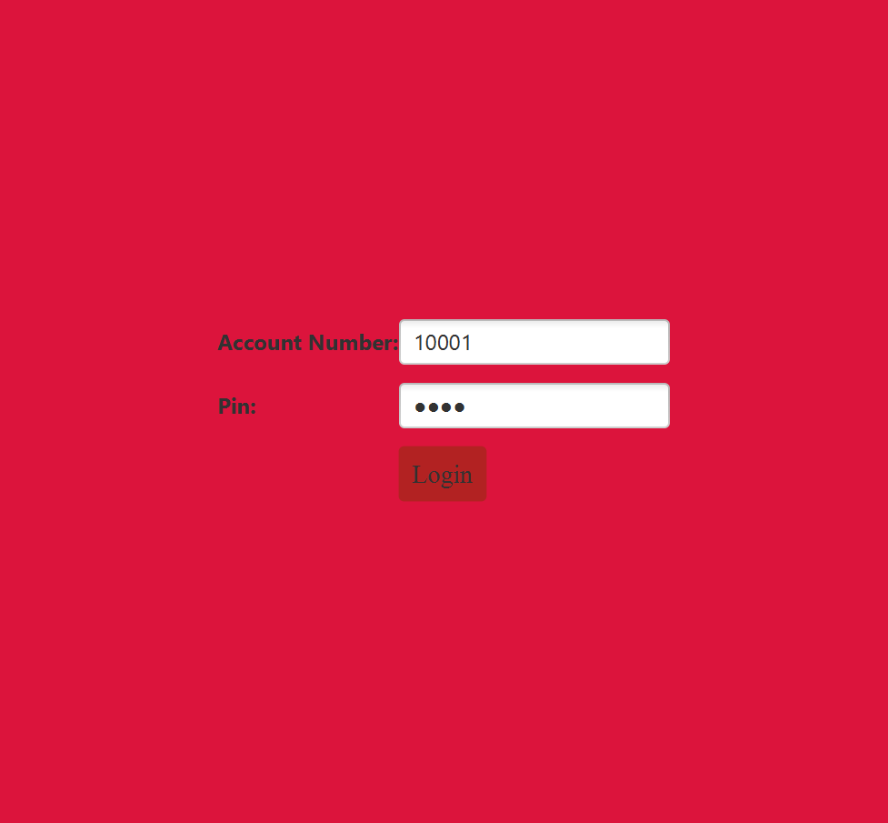
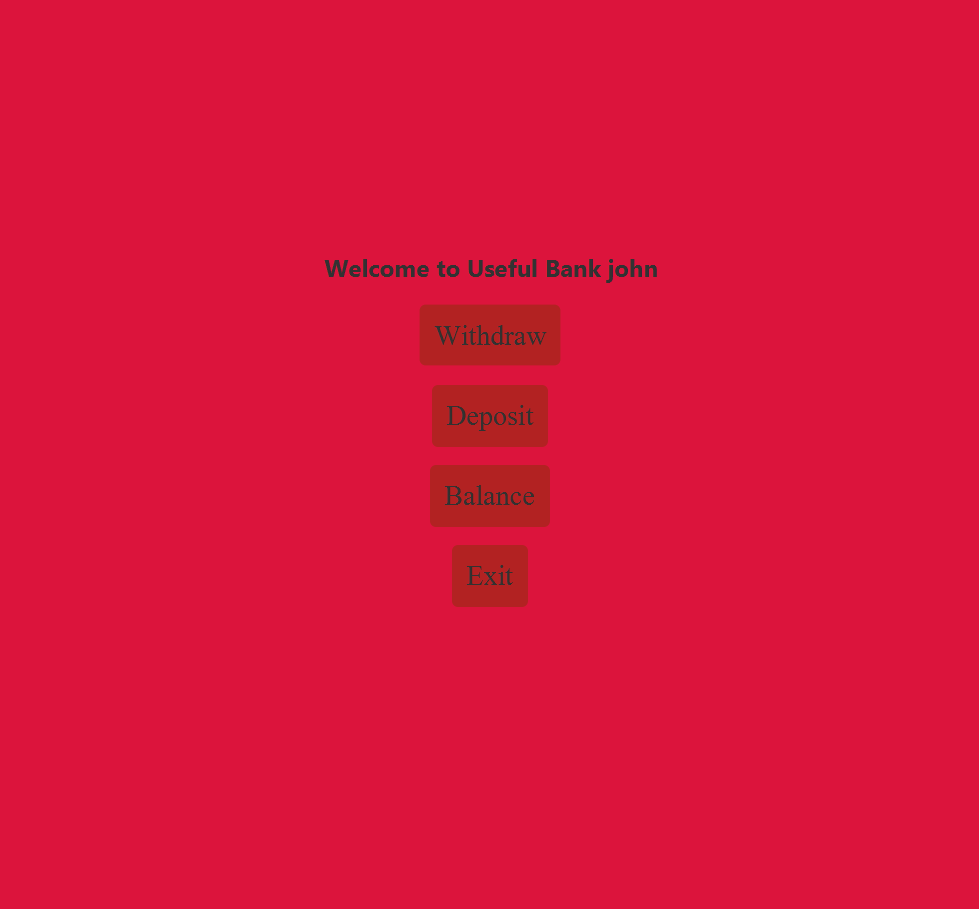

# BankManagement

An Atm Client/Server application made to demonstrate the uses of Object oriented programming, networking concurrency, and databases

## How it works

When you run the Server application the main method creates the database tables if not created yet, adds the users and accounts specified, and starts the server listening and handling connections. 

Running the client program connects to the server and when you attemt a login, the server checks the credentials agains the database and if correct allows you to perform banking actions. When you exit updates are saved to database

## Client Images

 

